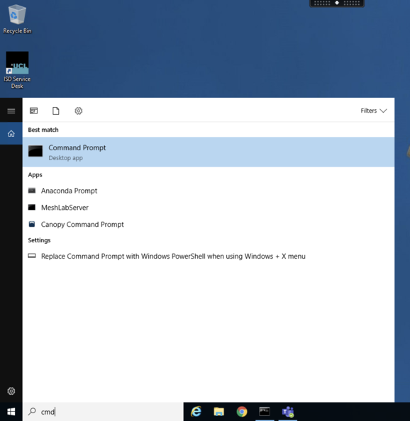

# Aristotle@UCL

This is a tutorial for working with the Aristotle computer service (read: a server, a remote computer) on the UCL computer center resources. 

## What is Aristotle
Aristotle is an interactive, Linux-based compute service (a computer) for teaching, running on three each node 64 gigabytes of RAM and 16 cores. It is maintined by the UCL compute services and is accessible for all students and teaching staff. 

The nodes run the Red Hat Enterprise Linux operating system (RHEL 7). 

For more details see the Information Services Division web pages at UCL: [ISD](
 https://www.rc.ucl.ac.uk/docs/Other_Services/Aristotle/) for more information.

## How to connect to Aristotle from your PC/MAC/LINUX machine

for the most up to date information, see the official documentation on [UCL-IDS website](https://www.rc.ucl.ac.uk/docs/howto/). An excerpt is below, but always refer or at least check the official docs. 

## If you are using a Linux / Unix / Mac OS X / Windows 10 or 11

Use the terminal application and type the below command to secure shell (ssh) into the machine you wish to access. 

Replace <your_UCL_user_id> with your central UCL username, and <system_name> with the name of the machine you want to log in to, eg. myriad, kathleen, aristotle.

`ssh <your_UCL_user_id>@<system_name>.rc.ucl.ac.uk`

**NOTE**: if you are not connected to the EDUROAM wifi network while st UCL, then you need to use [VPN](https://www.ucl.ac.uk/isd/services/get-connected/ucl-virtual-private-network-vpn) first before connecting to ARISTOTLE (alternatively you van use a gateway but is outside the scope of this how-to)

**NOTE** for connecting from China, plese see the official [UCL documentaiotn](https://www.rc.ucl.ac.uk/docs/howto/#china-connect)

**You need to use a Terminal for running applications on Aristotle!**

For this tutorial you need a Terminal program runnig an appropriate shell on your laptop/desktop and connect to a shell (a remote terminal) in Aristotle. .

This is also needed if you are using [UCL Desktop@Anywhere](https://www.ucl.ac.uk/isd/services/computers/remote-access/desktopucl-anywhere)

### Addditional information for Microsoft Windows PC users

On Windows you need something that will give you a suitable terminal and ssh - usually PuTTY, or on Windows 10/11 you can use the builtin OpenSSH from a command prompt and type the same ssh command as the Linux instructions.

* Get [putty](https://www.rc.ucl.ac.uk/docs/howto/#windows-putty). For details how to set it up see: [https://www.rc.ucl.ac.uk/docs/howto/](https://www.rc.ucl.ac.uk/docs/howto/)
* or on windows 100/11 open a windows "CMD" or Powershell. To use CMD, go to the search area in the panel and type cmd or command, it should appear like so: 

 

then click on Command Prompt to launch it, and type in it 

`ssh <ucl_user_id>@aristotle.rc.ucl.ac.uk`

(you can also use powershell instead). 

### Addditional information for MacOs and Linux users

For **Mac/Linux** open a Terminal application (use spotlight search to find it) then use ssh to connect to Aristotle as in windows CMD above, i.e., type:

`ssh <ucl_user_id>@aristotle.rc.ucl.ac.uk`

### Enter your UCL password once asked

Then you will be asked for the password. **Note while you type the password on the terminal, you will not see anything being typed! this is to make sure now one sees your password! just type the password carefully and then hit Enter key**

Now you should be logged in and get something similar to the following prompt: 

### More information about using a Unix(R) like shell - The Command Line Interface (CLI)
When you log into aristotle you are actually getting a terminal with a commmand line interface (CLI). A CLI is a text-based interface that allows users to manage the computer and run applications, and organise files. A CLI expects an input command, executes it, and prints the output. Specifically, once you ssh into Aristotle you will get a command line with a shell CLI  running in it, usually this will be a bash shell. 

For much more tharough information and help about the linux/Mac (in fact, more generally UNIX) Terminal see [A guide to the Linux terminal for beginners](https://opensource.com/article/21/8/linux-terminal) and a nice intro to the [main commands you need in a terminal](https://www.redhat.com/sysadmin/10-commands-terminal).

## Setting up and running Lammps on Aristotle 
See the file `aristotle_lammps_howto.md` in this repo. 

## Setting up and running Quantum Espresso on Aristotle 
See the file `aristotle_quantumEspresso_howto.md` in this repo. 

