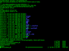

# LAMMPS on Aristotle@UCL

## Introduction 
This is a tutorial for setting up and running Lammps on Aristotle at UCL. 

## What is LAMMPS

LAMMPS stands for Large-scale Atomic/Molecular Massively Parallel Simulator.

LAMMPS is a classical molecular dynamics simulation code with a focus on materials modeling. It was designed to run efficiently on parallel computers. It was developed originally at Sandia National Laboratories, a US Department of Energy facility. The majority of funding for LAMMPS has come from the US Department of Energy (DOE). LAMMPS is an open-source code, distributed freely under the terms of the GNU Public License Version 2 (GPLv2).

## Where can I find more information about LAMMPS
The best source of information is the [LAMMPS home page](https://www.lammps.org) and the [LAMMPS manual](https://docs.lammps.org/Manual.html). LAMMPS is also found on a [github repository](https://github.com/lammps/lammps) 

## What is Aristotle
Aristotle is an interactive, Linux-based compute service for teaching, running on three each with 64 gigabytes of RAM and 16 cores. 
The nodes run the Red Hat Enterprise Linux operating system (RHEL 7)
see [ISD](
 https://www.rc.ucl.ac.uk/docs/Other_Services/Aristotle/) for more information.

## How to connect to Aristotle 
See the official documentation on [UCL-IDS](https://www.rc.ucl.ac.uk/docs/howto/) HOW TO. 

## You need to use a Terminal for this tutorial
For this tutorial you need a Terminal program on your desktop and connect to a shell (a remote terminal) in Aristotle. .

In windows 10/11 you can either use [putty](https://www.rc.ucl.ac.uk/docs/howto/#windows-putty) or open a cmd or powershell (or WSL2) while for Mac/Linux a local terminal then use ssh to connect to Aristotle. For more information and help about the linux/maac (in fact, more generally UNIX) Terminal see [A guide to the Linux terminal for beginners](https://opensource.com/article/21/8/linux-terminal).

# Step1: Setting up Lammps on Aristotle 
Lammps is one of the supported and already available packages but it needs to be activated. Once you are logged in execute the following commands: 

 `module load gcc-libs/4.9.2`

`module load compilers/intel/2018/update3`

`module load mpi/intel/2018/update3`

`module load lammps/7Aug19/userintel/intel-2018`

Note: run each command separately by copy and pasting the entire line and hitting enter afterwards. If there are issues, please submit an issue or email me directly. 

Each of these commands will enable various parts of the environment needed to run Lammps (e.g., defining which compilers, libraries and executable to load into your path)

Once these commands have run, you should have the executable `lmp_default` in your path and you are ready to move to the next section. 

# Step 2: downloading the LAMMPS tutorials 
We shall use some of the official LAMMPS tutorials. First we need to download them either 

1. from the [official repository](https://github.com/lammps/lammps/tree/master) using a web browser to your local drive and then using scp to move them to Aristotle (see [instructions here](https://www.rc.ucl.ac.uk/docs/howto/#scp)) or 
2. Use git clone to a local folder of the entire LAMMPS github repository including source code like so (this is run in a terminal on Aristotle): `git clone 
3. simple we copy them from the install folder on Aristotle which for the time of writing of this how to is in '/shared/ucl/apps/lammps/7Aug2019/USERINTEL/intel-2018/lammps/examples'

We need the following tutorials: 

1. melt:     rapid melt of 3d LJ system
2. min:      energy minimization of 2d LJ melt
3. obstacle: flow around two voids in a 2d channel
4. flow:     Couette and Poiseuille flow in a 2d channel

WIP